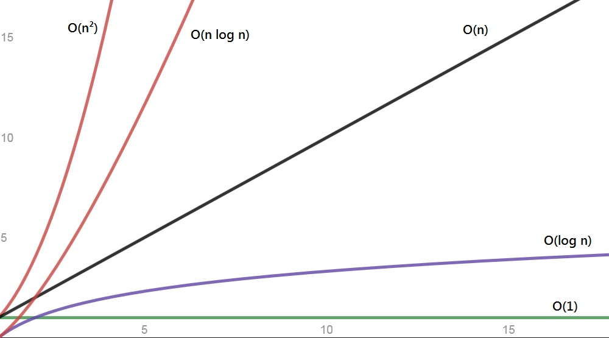

# Big O Notation

**Big O Notation** is used to classify algorithms according to how their running **time** or **space** requirements grow as the input size grows.

| Notation         | Type          | Description |
| ---------------- | ------------- | ----------- |
| O(1)             | constant      | remains constant regardless of the size of the input |
| O(log n)         | logarithmic   | increases by a constant |
| O(n)             | linear        | increases in proportion to n |
| O(n log n)       | n log n       | increases at a multiple of a constant |
| O(n2) | quadratic     | increases in proportion to the product of n * n |
